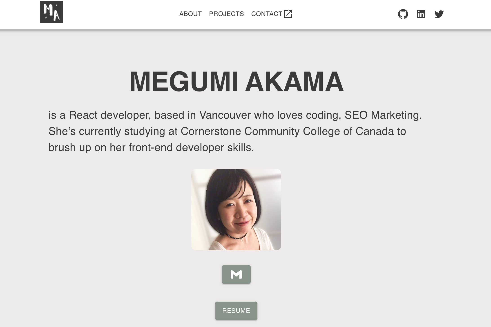

## About this project
This is my portfolio website using React.js and Material UI.

## View the website
You can access my website through [this link](#)

## Things that I learned
- Various kinds of components in Material UI
- How to implement a slideshow 
- How to use React Router

## Future Improvement
- Add contact form with connection to the back-end
- Add more animations which make my website more sophisticated and attractive in terms of design 

